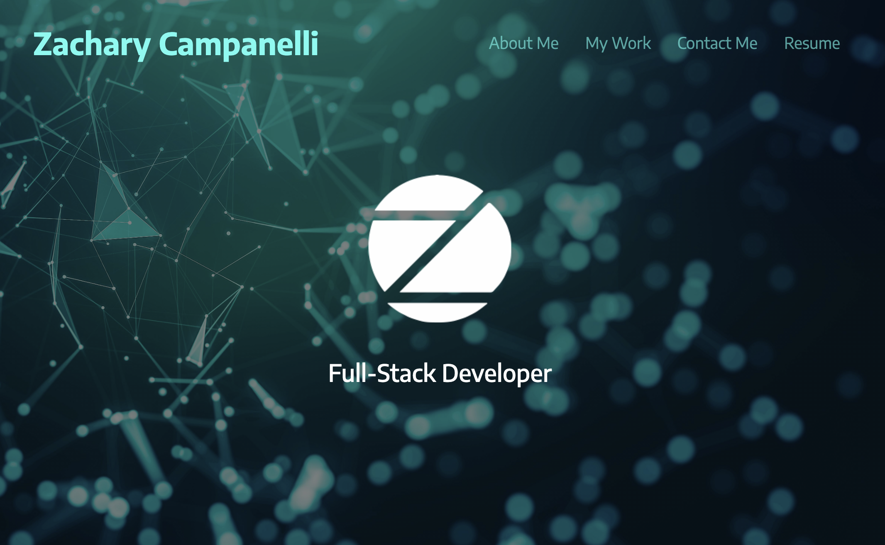
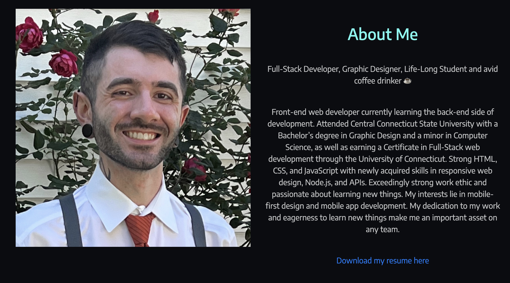
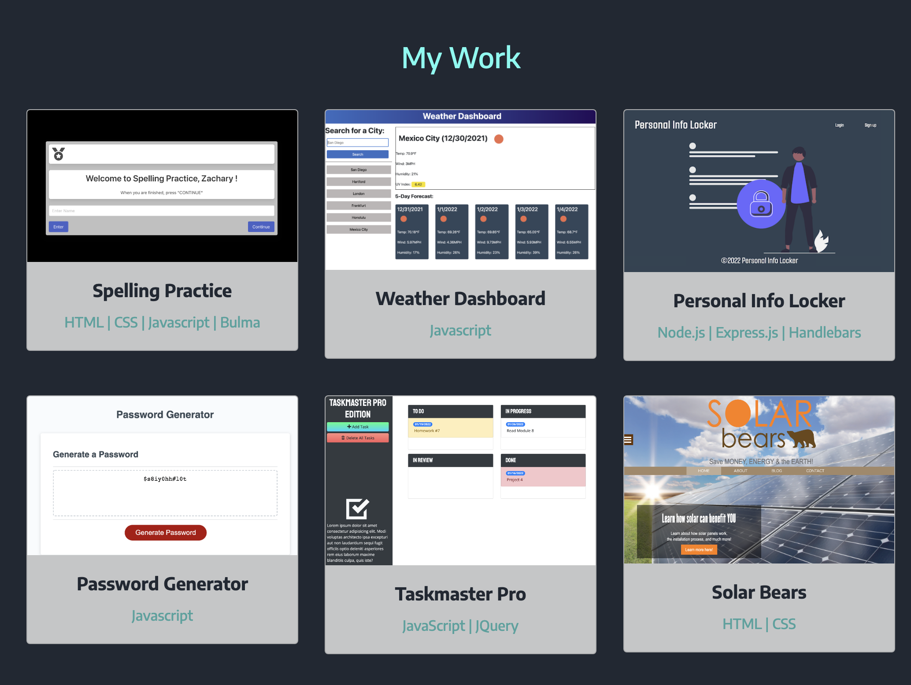

# Updated Portfolio

## Description

A webpage designed used HTML and advanced CSS to display my personal portfolio. This webpage:

- Uses mobile-friendly design
- Includes CSS animations 
- Has a link to view/download my resume
- Styled using Bootstrap
- Includes a modal for each project with more information on each project as well as links to the project's repository and a deployed link

## Screenshots

## License

A short and simple permissive license with conditions only requiring preservation of copyright and license notices. Licensed works, modifications, and larger works may be distributed under different terms and without source code.

## Questions

If you have any questions, concerns, or comments, feel free to contact me:

-GitHub: [Zacharycampanelli](https://github.com/Zacharycampanelli)  
-Email: [zaccamp@optonline.net](mailto:zaccamp@optonline.net)

## Links

-Link to [GitHub Repo](https://zacharycampanelli.github.io/Updated-Portfolio/)

-Link to [Deployed Webpage](https://zacharycampanelli.github.io/Updated-Portfolio/)